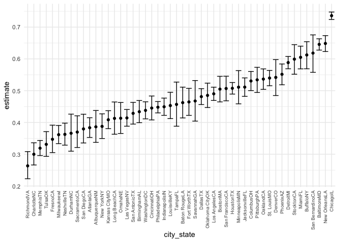
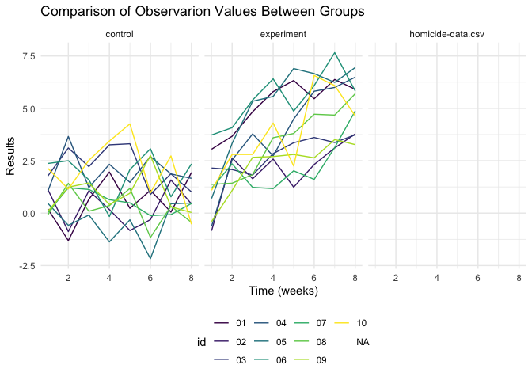

P8105 HW5
================
Hansheng Zhang
2021-11-19

``` r
library(tidyverse)
```

    ## ── Attaching packages ─────────────────────────────────────── tidyverse 1.3.1 ──

    ## ✓ ggplot2 3.3.5     ✓ purrr   0.3.4
    ## ✓ tibble  3.1.4     ✓ dplyr   1.0.7
    ## ✓ tidyr   1.1.3     ✓ stringr 1.4.0
    ## ✓ readr   2.0.1     ✓ forcats 0.5.1

    ## ── Conflicts ────────────────────────────────────────── tidyverse_conflicts() ──
    ## x dplyr::filter() masks stats::filter()
    ## x dplyr::lag()    masks stats::lag()

``` r
library(readxl)
library(p8105.datasets)

knitr::opts_chunk$set(
  warning = FALSE,
  message = FALSE
)
theme_set(theme_minimal() + theme(legend.position = "bottom"))
options(
  ggplot2.continuous.colour = "viridis",
  ggplot2.continuous.fill = "viridis"
)
scale_colour_discrete = scale_colour_viridis_d
scale_fill_discrete = scale_fill_viridis_d
```

# Problem 1

This problem is about homicides in 50 large U.S. cities. The data comes
from *The Washington Post*. The solution comes from Jeff’s echo
recording.

``` r
homicide_df = 
  read_csv("./Data/homicide-data.csv", na = c("", "uknown")) %>% 
  mutate(city_state = str_c(city, state),
  resolution = case_when(
    disposition == "Closed without arrest" ~ "unsolved",
    disposition == "Open/No arrest"        ~ "unsolved",
    disposition == "Closed by arrest"      ~ "solved"
  )) %>% 
  relocate(city_state)
```

Focusing on Baltimore, MD

``` r
baltimore_df = 
  homicide_df %>% 
  filter(city_state == "BaltimoreMD")
baltimore_summary =
  baltimore_df %>% 
  summarise(
    unsolved = sum(resolution == "unsolved"),
    n = n()
    )
baltimore_test = 
  prop.test(
    x = baltimore_summary %>% pull(unsolved),
    n = baltimore_summary %>% pull(n))
baltimore_test %>% 
  broom::tidy() %>% 
  knitr::kable()
```

|  estimate | statistic | p.value | parameter |  conf.low | conf.high | method                                               | alternative |
|----------:|----------:|--------:|----------:|----------:|----------:|:-----------------------------------------------------|:------------|
| 0.6455607 |   239.011 |       0 |         1 | 0.6275625 | 0.6631599 | 1-sample proportions test with continuity correction | two.sided   |

``` r
prop_test_function = function(city_df){
  
  city_summary = 
    city_df %>% 
      summarise(
        unsolved = sum(resolution == "unsolved"),
        n = n()
      )
  
  city_test = 
    prop.test(
      x = city_summary %>% pull(unsolved),
      n = city_summary %>% pull(n)
    )
  
  return(city_test)
  
}
# trying for another city 
homicide_df %>% 
  filter(city_state == "AlbuquerqueNM") %>% 
  prop_test_function() %>% 
  broom::tidy() %>% 
  knitr::kable()
```

|  estimate | statistic |  p.value | parameter |  conf.low | conf.high | method                                               | alternative |
|----------:|----------:|---------:|----------:|----------:|----------:|:-----------------------------------------------------|:------------|
| 0.3862434 |  19.11376 | 1.23e-05 |         1 | 0.3372604 | 0.4375766 | 1-sample proportions test with continuity correction | two.sided   |

``` r
results_df = 
  homicide_df %>%
  nest(data = uid:resolution) %>%
  mutate(
    test_results = map(data, prop_test_function),
    tidy_results = map(test_results, broom::tidy)
    ) %>% 
    select(city_state, tidy_results) %>% 
    unnest(tidy_results) %>% 
    select(city_state, estimate, starts_with("conf"))
head(results_df) %>% 
  knitr::kable()
```

| city\_state   |  estimate |  conf.low | conf.high |
|:--------------|----------:|----------:|----------:|
| AlbuquerqueNM | 0.3862434 | 0.3372604 | 0.4375766 |
| AtlantaGA     | 0.3833505 | 0.3528119 | 0.4148219 |
| BaltimoreMD   | 0.6455607 | 0.6275625 | 0.6631599 |
| Baton RougeLA | 0.4622642 | 0.4141987 | 0.5110240 |
| BirminghamAL  | 0.4337500 | 0.3991889 | 0.4689557 |
| BostonMA      | 0.5048860 | 0.4646219 | 0.5450881 |

``` r
results_df %>% 
  filter(city_state != "TulsaAL") %>% 
  mutate(city_state = fct_reorder(city_state, estimate)) %>% 
  ggplot(aes(x = city_state, y = estimate)) +
  geom_point() +
  geom_errorbar(aes(ymin = conf.low, ymax = conf.high)) +  
  theme(axis.text.x = element_text(size = 7, angle = 90, vjust = 0.5, hjust = 1))
```

<!-- -->

## Problem 2

``` r
data_path = str_c("./Data/", list.files(path = "./Data/"))
new_data = tibble(
  file_name = list.files(path = "./Data/"),
  participants = purrr::map(data_path, read_csv) 
) %>% 
  separate(file_name, into = c("arm","ID"), sep = "_") %>% 
  separate(col = "ID", into = c("id", "csv")) %>%
  mutate(
    arm = recode(arm, con = "control", exp = "experiment" )
    ) %>% 
  select(-csv) %>% 
  unnest(participants) %>%
  pivot_longer(
    week_1:week_8,
    names_to = "week",
    names_prefix = "week_",
    values_to = "observations"
  ) %>% 
  mutate(week = as.numeric(week)) %>%
  mutate(arm = as.factor(arm))
  
new_data
```

    ## # A tibble: 417,592 × 16
    ##    arm     id    uid   reported_date victim_last victim_first victim_race
    ##    <fct>   <chr> <chr>         <dbl> <chr>       <chr>        <chr>      
    ##  1 control 01    <NA>             NA <NA>        <NA>         <NA>       
    ##  2 control 01    <NA>             NA <NA>        <NA>         <NA>       
    ##  3 control 01    <NA>             NA <NA>        <NA>         <NA>       
    ##  4 control 01    <NA>             NA <NA>        <NA>         <NA>       
    ##  5 control 01    <NA>             NA <NA>        <NA>         <NA>       
    ##  6 control 01    <NA>             NA <NA>        <NA>         <NA>       
    ##  7 control 01    <NA>             NA <NA>        <NA>         <NA>       
    ##  8 control 01    <NA>             NA <NA>        <NA>         <NA>       
    ##  9 control 02    <NA>             NA <NA>        <NA>         <NA>       
    ## 10 control 02    <NA>             NA <NA>        <NA>         <NA>       
    ## # … with 417,582 more rows, and 9 more variables: victim_age <chr>,
    ## #   victim_sex <chr>, city <chr>, state <chr>, lat <dbl>, lon <dbl>,
    ## #   disposition <chr>, week <dbl>, observations <dbl>

Making a spaghetti plot showing observations on each subject over time,
and comment on differences between groups.

``` r
new_data %>% 
 ggplot(aes(x = week, y = observations, color = id)) +
  facet_grid(. ~ arm) +
  geom_line() +
   labs(
    title = "Comparison of Observarion Values Between Groups",
    x = "Time (weeks)",
    y = "Results"
    )
```

<!-- -->

Subjects in the experimental group appear to increase in value over
weeks 1-8, while no trends were observed in subjects in the control
group. The results of the experimental group also appear to be higher
than the control group.

## Problem 3

Load ‘iris’ dataset

``` r
library(tidyverse)

set.seed(10)

iris_with_missing = iris %>% 
  map_df(~replace(.x, sample(1:150, 20), NA)) %>%
  mutate(Species = as.character(Species))
iris_with_missing
```

    ## # A tibble: 150 × 5
    ##    Sepal.Length Sepal.Width Petal.Length Petal.Width Species
    ##           <dbl>       <dbl>        <dbl>       <dbl> <chr>  
    ##  1          5.1         3.5          1.4         0.2 setosa 
    ##  2          4.9         3            1.4         0.2 setosa 
    ##  3          4.7         3.2          1.3         0.2 setosa 
    ##  4          4.6         3.1          1.5        NA   setosa 
    ##  5          5           3.6          1.4         0.2 setosa 
    ##  6          5.4         3.9          1.7         0.4 setosa 
    ##  7         NA           3.4          1.4         0.3 setosa 
    ##  8          5           3.4          1.5         0.2 setosa 
    ##  9          4.4         2.9          1.4         0.2 setosa 
    ## 10          4.9         3.1         NA           0.1 setosa 
    ## # … with 140 more rows

Write a function that takes a vector as an argument; replaces missing
values using the rules defined above; and returns the resulting vector.

``` r
missing_value = function(x) {
   if (is.numeric(x)) {
     replace_na(x, round(mean(x,na.rm = TRUE), digits = 1))
   }
   else if(is.character(x)){
    replace_na(x,"virginica")
   }
} 
map_dfr(iris_with_missing, missing_value)
```

    ## # A tibble: 150 × 5
    ##    Sepal.Length Sepal.Width Petal.Length Petal.Width Species
    ##           <dbl>       <dbl>        <dbl>       <dbl> <chr>  
    ##  1          5.1         3.5          1.4         0.2 setosa 
    ##  2          4.9         3            1.4         0.2 setosa 
    ##  3          4.7         3.2          1.3         0.2 setosa 
    ##  4          4.6         3.1          1.5         1.2 setosa 
    ##  5          5           3.6          1.4         0.2 setosa 
    ##  6          5.4         3.9          1.7         0.4 setosa 
    ##  7          5.8         3.4          1.4         0.3 setosa 
    ##  8          5           3.4          1.5         0.2 setosa 
    ##  9          4.4         2.9          1.4         0.2 setosa 
    ## 10          4.9         3.1          3.8         0.1 setosa 
    ## # … with 140 more rows
